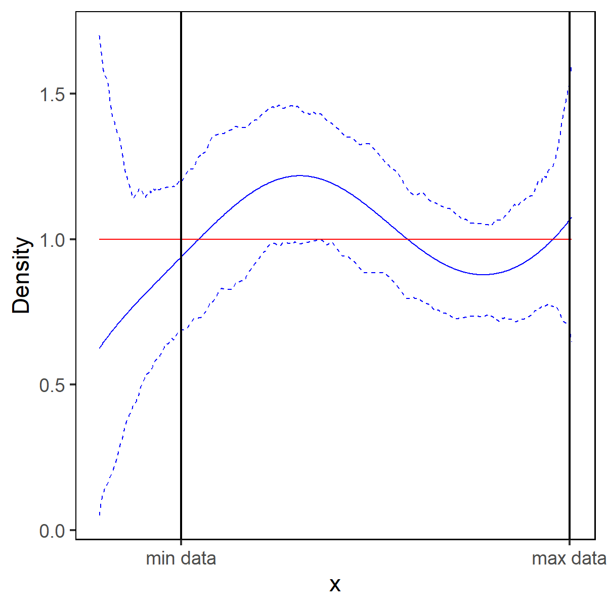
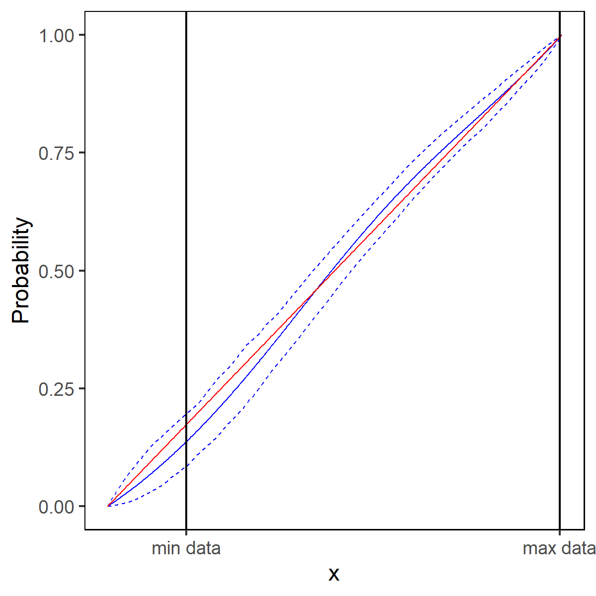

## Overview

Estimate an unknown distribution from order statistic data using Bayesian nonparametrics and MCMC.

## Motivation

In settings like auctions, we observe different order statistics (e.g. highest bids from varying numbers of bidders), rather than full samples. The method handles independent, non-identically distributed data and truncated observations, allowing recovery of the underlying distribution.

## Method

- **Representation**: Bernstein polynomials approximate the CDF  
- **Likelihood**: Based on order statistic densities  
- **Prior**: Dirichlet over polynomial weights  
- **Inference**: Metropolis–Hastings MCMC  
- **Model selection**: Marginal likelihood over polynomial order  

## How to run

### Full pipeline (recommended)

Run the entire simulation in batch mode:

```bash
Rscript ./simulation/master.r
```

### Manual execution (optional)

Run scripts step-by-step for more control:

1. Generate data  
2. Estimate density (default `K_list=10`, can be changed)  
3. Merge estimates  
4. Run model selection and posterior analysis  
5. Plot results

## Output

- Estimated density and CDF  
- Credible intervals  
- Comparison to true distribution (simulated data)

## Example output

<div style="display: flex; gap: 20px;">
  
  
</div>

<p align="center">
  
</p>

## Workflow

Simulate data → Build basis → Run MCMC → Select model → Summarize posterior → Plot results  

## Tools

R (dplyr, stringr, extraDistr, pracma, ggplot2, latex2exp, mvtnorm)

## Highlights

- Bayesian nonparametric modeling  
- Custom MCMC implementation  
- Full statistical pipeline  
